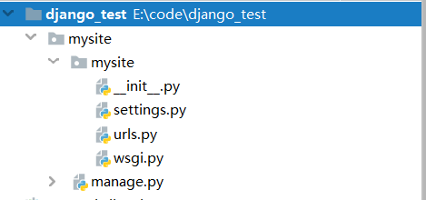
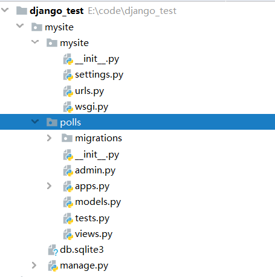

# django学习

##  django 创建project

加入代码存放目录 执行命令

`django-admin startproject mysite`
生成的代码结构如图



## 运行内置服务器

`python manage.py runserver`

默认输入`runserver`，服务运行在本机8000端口，可以指定 ip:port ,ip可以省略。0 为0.0.0.0 缩写

```shell
$ python manage.py runserver 8080
```

```shell
$ python manage.py runserver 0:8000
```

## 创建app

`python manage.py startapp polls`

创建的app 目录与`manage.py`同级



## 编写view文件

编辑文件 `polls/views.py` 并添加代码如下

```python
from django.http import HttpResponse


def index(request):
    return HttpResponse("Hello, world. You're at the polls index.")
```

为了查看本view，需要将其 map 到一个 URL - 我们需要一个urlconf文件

所以在polls下创建文件`urls.py`. Your app directory should now look like:

```python
polls/
    __init__.py
    admin.py
    apps.py
    migrations/
        __init__.py
    models.py
    tests.py
    urls.py
    views.py
```

在 `polls/urls.py` 文件置入如下代码

```python
from django.urls import path

from . import views

urlpatterns = [
    path('', views.index, name='index'),
]
```

为了在`mysite/urls.py`,可以导航到polls，需要这样写：

mysite/urls.py[¶](https://docs.djangoproject.com/en/3.0/intro/tutorial01/#id3)

```python
from django.contrib import admin
from django.urls import include, path

urlpatterns = [
    path('polls/', include('polls.urls')),
    path('admin/', admin.site.urls),
]
```

`include()`允许引用到其他urlconf文件

`path()`的几个参数

### [`path()`](https://docs.djangoproject.com/en/3.0/ref/urls/#django.urls.path) argument: `route`

`route` is a string that contains a URL pattern. When processing a request, Django starts at the first pattern in `urlpatterns` and makes its way down the list, comparing the requested URL against each pattern until it finds one that matches.

Patterns don’t search GET and POST parameters, or the domain name. For example, in a request to `https://www.example.com/myapp/`, the URLconf will look for `myapp/`. In a request to `https://www.example.com/myapp/?page=3`, the URLconf will also look for `myapp/`.


### [`path()`](https://docs.djangoproject.com/en/3.0/ref/urls/#django.urls.path) argument: `view`

When Django finds a matching pattern, it calls the specified view function with an [`HttpRequest`](https://docs.djangoproject.com/en/3.0/ref/request-response/#django.http.HttpRequest) object as the first argument and any “captured” values from the route as keyword arguments. We’ll give an example of this in a bit.


### [`path()`](https://docs.djangoproject.com/en/3.0/ref/urls/#django.urls.path) argument: `kwargs`

Arbitrary keyword arguments can be passed in a dictionary to the target view. We aren’t going to use this feature of Django in the tutorial.


### [`path()`](https://docs.djangoproject.com/en/3.0/ref/urls/#django.urls.path) argument: `name`

Naming your URL lets you refer to it unambiguously from elsewhere in Django, especially from within templates. This powerful feature allows you to make global changes to the URL patterns of your project while only touching a single file.

When you’re comfortable with the basic request and response flow, read [part 2 of this tutorial](https://docs.djangoproject.com/en/3.0/intro/tutorial02/) to start working with the database.

实验结果


## django setting

django 默认使用sqlite3，如果需要更改为别的数据库需要俩个条件

- 安装好对应数据库的连接driver，

- 更改DJANGO setting `ENGINE`字段

- 如果使用sqlite3，那么`NAME`字段需要指定为

  ```python
  'NAME': os.path.join(BASE_DIR, 'db.sqlite3'),
  ```


### `ENGINE`

Default: `''` (Empty string)

The database backend to use. The built-in database backends are:

- `'django.db.backends.postgresql'`
- `'django.db.backends.mysql'`
- `'django.db.backends.sqlite3'`
- `'django.db.backends.oracle'`

You can use a database backend that doesn’t ship with Django by setting `ENGINE` to a fully-qualified path (i.e. `mypackage.backends.whatever`).

###  `INSTALLED_APPS`

包括了在这个django instance里激活的app

默认 [`INSTALLED_APPS`](https://docs.djangoproject.com/en/3.0/ref/settings/#std:setting-INSTALLED_APPS) contains the following apps, all of which come with Django:

- [`django.contrib.admin`](https://docs.djangoproject.com/en/3.0/ref/contrib/admin/#module-django.contrib.admin) – The admin site. You’ll use it shortly.
- [`django.contrib.auth`](https://docs.djangoproject.com/en/3.0/topics/auth/#module-django.contrib.auth) – An authentication system.
- [`django.contrib.contenttypes`](https://docs.djangoproject.com/en/3.0/ref/contrib/contenttypes/#module-django.contrib.contenttypes) – A framework for content types.
- [`django.contrib.sessions`](https://docs.djangoproject.com/en/3.0/topics/http/sessions/#module-django.contrib.sessions) – A session framework.
- [`django.contrib.messages`](https://docs.djangoproject.com/en/3.0/ref/contrib/messages/#module-django.contrib.messages) – A messaging framework.
- [`django.contrib.staticfiles`](https://docs.djangoproject.com/en/3.0/ref/contrib/staticfiles/#module-django.contrib.staticfiles) – A framework for managing static files.

在使用这些app时，由于app可能使用了数据库，那么需要先执行以下

```python
$ python manage.py migrate
```

创建数据库model

编辑 `polls/models.py` file so it looks like this:

polls/models.py

```python
from django.db import models


class Question(models.Model):
    question_text = models.CharField(max_length=200)
    pub_date = models.DateTimeField('date published')


class Choice(models.Model):
    question = models.ForeignKey(Question, on_delete=models.CASCADE)
    choice_text = models.CharField(max_length=200)
    votes = models.IntegerField(default=0)
```

model类继承 `django.db.models.Model` ,并且每一个model类都有数个类变量，这些类变量会存储在数据库里作为colume_name